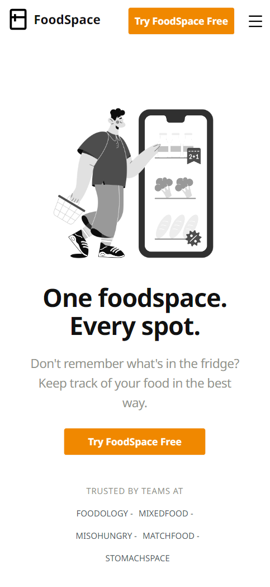
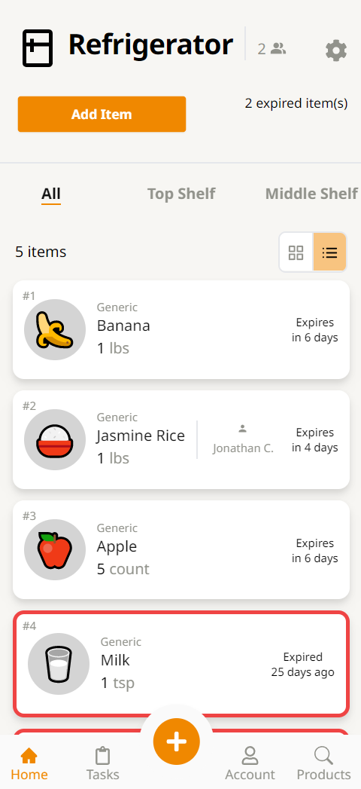
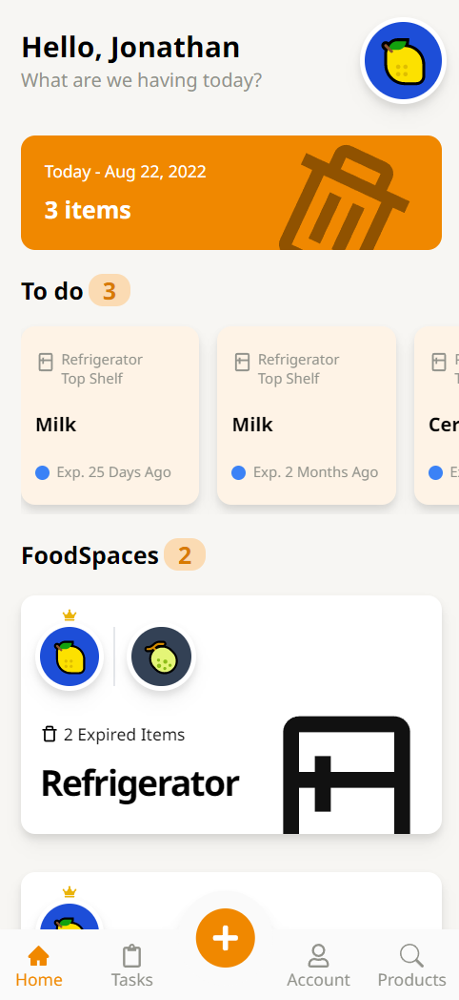

# FoodSpace

> A web app that tracks, manages, and organizes the food in your household.

## Objective
To solve the problem of having to remember if items are the in your house or if they have expired. By using this app, it will not only notify if you have a certain product in your house, but also let you know when something has expired.

## Screenshots
<ul style="display:flex flex-direction:column">
 

    
</ul>


## Live Demo
https://jonathancarpena.me/demo/foodspace


## Tech Stack

### Front End:

- React
- Redux
- Tailwind CSS

### Back End: 
- MongoDB
- Express
- Node.js
- jsonwebtoken
- bcrypt


## Features

- Authentication
    - User registration
    - User login with email and password
    - Email collision feature 
- Authorization
    - User cannot create new foodspace without being authenticated
    - User cannot delete foodspace created by another user
    - User cannot delete or edit items that are owned by another user
- Managing Food Spaces with basic functionalities
    - Create, Read, Update and Delete areas, food items, and users.
    - Upload new food items to the product database.
    - Browse through the product database.
- Mobile Design


## Setup

Clone down this repository. You will need node and npm installed globally on your machine.
```
$ git clone https://github.com/jonathancarpena/foodspace.git
```
1. Install project folder `npm install`
1. Install frontend packages `cd frontend`  `npm install`
1. Install backend packages `cd backend`  `npm install`


    
## Environment Variables

To run this project, you will need to add the following environment variables to your .env file inside the backend folder.

`MONGO_URI`: Register a new cluster in MongoDB Atlas and record your Mongo URI

`TOKEN_KEY`: a randomly generated string of numbers and letters. (Ex. "8c6b1abd9d8c44eb")

## Scripts


Development mode. Open http://localhost:3000 to view it in the browser. 
```
npm run dev
```

Server-side. (PORT:5000) Open http://localhost:5000 to access.
```
npm run server
```

Client-side. (PORT:3000) Open http://localhost:3000 to view it in the browser.
```
npm run client
```


